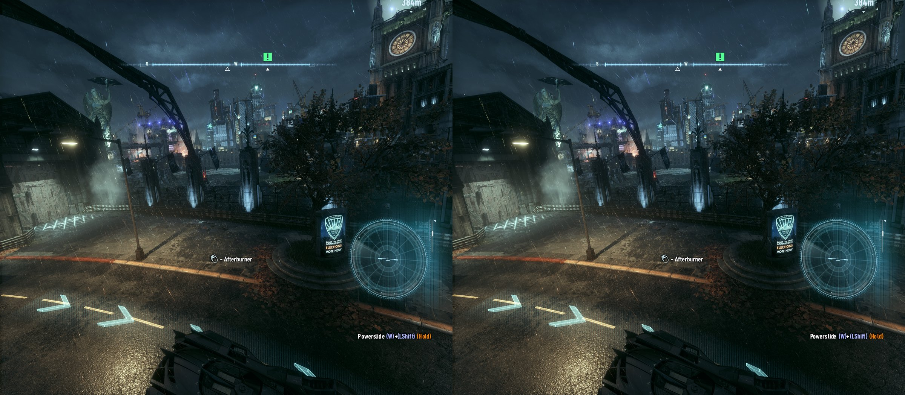
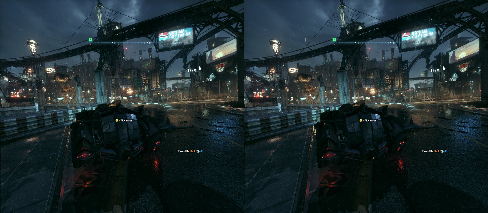

# Batman: Arkham Knight VR

Play Batman: Arkham Knight in PC VR with native stereo, your head moving the camera, and the
game's third-person view kept intact.

## Native stereo

Every frame, the game renders both eyes, each from its own position, at the same moment.
Nothing is reconstructed from a flat image, and the eyes never take turns, so swinging the
camera never leaves one eye behind the other. Everything in the scene, near or far, has
correct depth.





*The two eye pictures side by side, saved by the mod while playing.*

## How it works

- **geo-11** (a free stereo 3D tool, with a community fix for Arkham Knight) makes the game
  draw a separate picture for each eye.
- **This mod** shows those two pictures in your headset, moves the game's camera with your
  head, and adds an in-headset settings panel. It uses OpenXR, the standard way PC games talk
  to VR headsets.

## Working (checked in the headset)

- Native stereo through geo-11
- Head tracking. The camera follows the game's own up-and-down tilt, and turning your
  head never tilts the horizon.
- Smooth camera when spinning with the stick
- World scale you can change live
- Radar flicker fixed
- Move, resize or hide single HUD parts (radar, compass, radio); your layout is remembered
- Menus shown at a comfortable size
- The game's graphics menu no longer undoes the VR picture size
- HUD distance you can change live, and no stutter after leaving the pause menu or map
- A steady HUD on its own layer, with the grapple reticle and objective marker at the depth
  of what they point at

## Installing

You download the mod and the 3D fix, then run the installer. It puts everything into the game
folder (the one with `BatmanAK.exe`) and sets it up for VR, so you don't copy or unpack
anything there yourself.

### What you need

- Batman: Arkham Knight on PC
- A PC VR headset and the software you use for PC VR games, for example Virtual Desktop,
  SteamVR or the Meta Quest Link app. Tested with a Meta Quest 3 through Virtual Desktop;
  other headsets and software haven't been tested yet.
- A strong graphics card, since every picture is drawn twice. Tested on an NVIDIA RTX 4070 Ti.

geo-11 comes with the mod, so you don't need to download it.

### Steps

1. **Download the mod.** Under **Releases** on this page, open the newest release and download
   the `AKVR-ArkhamKnight` zip. Right-click it, choose **Extract All...**, and extract it in
   your Downloads folder.
2. **Download the 3D fix.** On the
   [Batman: Arkham Knight HelixMod page](https://helixmod.blogspot.com/2020/12/batman-arkham-knight-dx11.html),
   download the **geo-11 fix** (`Batman_Arkham_Knight_geo11_fix.7z`), not the 3D Vision one.
   Leave it in Downloads without unpacking it.
3. **Run the installer.** Close the game, open the `AKVR-ArkhamKnight` folder and double-click
   `Install-AKVR.bat`.
   - If Windows says "Windows protected your PC", click **More info**, then **Run anyway**.
   - If it asks for the game folder, pick the one with `BatmanAK.exe`. For Steam that's usually
     `C:\Program Files (x86)\Steam\steamapps\common\Batman Arkham Knight\Binaries\Win64`.
   - Wait for **Done.**, then press any key to close the window.
4. **Check your headset software (once).** It has to be the PC's active OpenXR runtime, which
   it usually already is. In Virtual Desktop, the Streamer app's **OpenXR Runtime** should be
   **VDXR**. In SteamVR or the Meta Quest Link app, look for the OpenXR setting in their
   settings.
5. **Play.** Connect your headset as you normally do and start the game from Steam (with
   Virtual Desktop, from its view of your PC). The first start takes a few minutes while
   geo-11 prepares its shaders, and the game may look frozen; let it finish. Press **F12** to
   face the view forward and **F8** for the settings panel.

The installer backs up everything it replaces into a `vrmod_backup_...` folder in the game
folder. Run it again at any time to repair an install, or after downloading a new version of
the mod or the fix.

### If something goes wrong

| What you see | What to do |
|---|---|
| The installer stops with a red **STOPPED** message | The message says what's missing. Most often it's the wrong fix file (the 3D Vision one instead of geo-11). |
| "could not copy the fix into the game folder" | Right-click `Install-AKVR.bat` and choose **Run as administrator**. |
| "some HUD edits could not be applied" | The 3D fix has changed since this version of the mod. Check for a newer version of the mod. Your previous files are in the `vrmod_backup` folder. |
| The game never goes into the headset | Connect the headset before starting the game, and check step 4. If you played another VR game before this one, restart the PC first. |
| The game is flat (no 3D) after updating geo-11 or the fix by hand | Run the installer again. |

### Removing it

Close the game, then double-click `Uninstall-AKVR.bat` in the game folder (the installer put
it there). It removes the mod and the 3D fix, including your VR settings, and puts back any
files the first install replaced. The `vrmod_backup_...` folders are left in place; delete
them yourself once you're sure you don't need them.

## Graphics settings

The game draws everything twice, once for each eye, so it needs about twice the graphics
power it normally would. These settings make the biggest difference.

**The mod already sets these, every time the game starts:**

- Windowed mode and the picture size. Don't change the display mode or resolution in the
  game's menu; the mod handles both.
- Motion blur, chromatic aberration and film grain off (all three are uncomfortable in VR)
- V-sync off (the headset sets the pace instead)

**Turn these off yourself** (in the game's graphics menu, under the NVIDIA GameWorks
options). They cost a lot, and the game is drawn twice:

- Enhanced Rain
- Enhanced Light Shafts
- Interactive Smoke / Fog
- Interactive Paper Debris

**Optional:**

- Anti-aliasing: the fix's author suggests turning it off, because it softens the picture.
- The fix has its own keys: **F6** turns depth of field on or off, and **L** turns lens
  flares on or off.

## The VR settings panel

Press **F8** to show or hide the panel. To use it with the controller, hold both stick
clicks (L3 + R3): the left stick moves, **A** selects or changes, **B** goes back, and both
stick clicks close it. The game ignores the controller while the panel has it. Everything
you change is saved.

At the top: **Recenter (F12)** faces the view forward, and **Save capture (F2)** saves
pictures and a recording, for troubleshooting.

### View

| Setting | What it does |
|---|---|
| World scale | How big the world feels. 1.00 is life size. Higher makes the world feel bigger around you; lower makes it feel like a model. **1.00** resets it. |
| Decouple the camera pitch | Off (normal): the view tilts up and down with the game's camera, as in the normal game. On: the horizon stays level and only your head tilts the view. |
| Right stick up/down: extra camera height | Only with the pitch decoupled: how far the right stick can raise the camera, in metres. |
| Extra view at the sides | Draws a little past the edges of the lenses, so no black edges show when you turn quickly. |
| Extra view top and bottom | The same for the top and bottom. Takes effect after a restart. **Same as sides** matches them. |
| Picture height per eye | Sharpness against speed. Higher is sharper and slower. Takes effect after a restart. |
| Use each eye's full view | Shapes each eye's picture to match its lens, saving about 20% of the work. Takes effect after a restart. Still being worked on: the compass shows double with it on. |
| Distance alignment | Only with each eye's full view: adjust until distant things look single. **Reset** goes back to the value measured from the headset. |
| Flip eye turn | Only with each eye's full view: tick it if everything looks badly doubled. |
| Where you stand | Moves your viewpoint left or right, down or up, back or forward. If you feel you're standing to the left of what you're looking at, move left/right to the right. **Reset position** undoes it. |

### HUD

| Setting | What it does |
|---|---|
| HUD size | How big the HUD is. |
| HUD up / down | Moves the whole HUD up or down. |
| HUD distance | How far away the HUD looks, in metres. 0 or **far away** puts it at the distance of far-off scenery. |
| HUD on its own layer (steady HUD) | Draws the HUD separately, attached to your head by the headset itself, so it stays steady instead of jumping with the game's frame rate. |
| Keep the reticle at the depth it points at | With the HUD layer on: reticles and markers that point at things (grapple reticle, objective marker) stay at the depth of what they point at, while the rest of the HUD stays on the steady layer. |
| Menus and map use the full height | Lets menus and the map fill the view from top to bottom. |
| Move / resize single HUD parts | Adjust the radar, compass and other parts one by one. With the HUD on screen, press **find the HUD parts**. Tick **hide** on a part to see which one it is, then open it to change its size and position. **Reset** undoes a part. Your layout is remembered. |

### Menus and screens

| Setting | What it does |
|---|---|
| Float as a screen now (Pause key) | Shows the game on a flat floating screen, for example for cutscenes. **With head tracking** keeps head tracking on while it floats. |
| Floating screen shape / size | The shape (the picture's own, 16:9 or 21:9) and size of that screen. |
| Main menu size | How big the main menu looks. |
| Pause / map / loading size and shape | How big the pause menu, map and loading screens look, and their shape (1.78 = 16:9). |
| Main menu: live 3D, follows your head | Shows the main menu as live 3D instead of a still picture. |
| Floating screens show a flat picture | Shows floating screens in 2D instead of 3D. |

### Frame rate

| Setting | What it does |
|---|---|
| Hold the game at | Keeps the game at a steady 45, 40 or 30 frames per second, which is smoother than an uneven rate. **Off** lets the game run as fast as it can. |
| Between game frames | What the headset shows between game frames: **repeat the frame**, or **Virtual Desktop SSW**, which makes in-between frames (Virtual Desktop only; set its SSW to Always). |
| Head-pose delay | Leave it at 3; that value was measured as correct. |

**Advanced** and **Diagnostics** are for testing. Leave them alone unless asked.

## Keys

| Key | What it does |
|---|---|
| F8 | Show or hide the settings panel |
| F11 | Head tracking on or off |
| F12 | Recenter |
| F2 | Save pictures and a recording, for troubleshooting |
| Pause | Show the game on a floating screen, or go back |

## Building

Needs Visual Studio 2022 and CMake. The project expects a `references` folder next to
this one, containing minhook, imgui and the OpenXR SDK.

```
cmake -S akvr -B akvr/build-dinput8 -DAKVR_PROXY=dinput8
cmake --build akvr/build-dinput8 --config Release --target akvr
```

Then run `install\Install-AKVR.bat` from the repository instead of the downloaded package: it
finds the `dinput8.dll` you built by itself.

